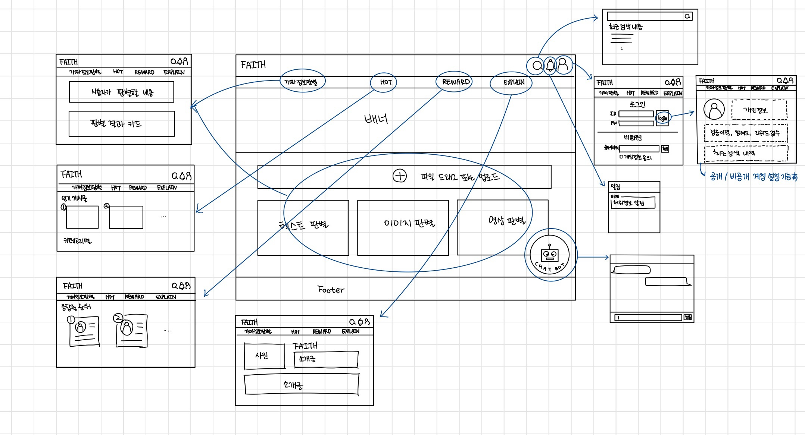

# capstone25-faith
## FAITH — AI 기반 허위 정보 수집·검증 및 팩트체크 플랫폼

> **FAITH**는 생성형 AI·딥페이크·가짜뉴스 등 **허위 정보**를 자동/준실시간으로 분석하고, 사용자 참여형 구조로 신뢰할 수 있는 검증 결과를 제공하는 **팩트체크 플랫폼**입니다.

---

## 1. 문제 배경 및 목적

디지털 미디어 발전으로 정보 확산 속도가 급격히 증가하면서, 기술을 악용한 허위 정보 확산이 심각한 사회 문제로 대두되고 있습니다.  
특히 **딥페이크(Deepfake)** 기술은 실제와 구분하기 어려운 조작 이미지/영상을 쉽게 생성해 개인의 명예 훼손 및 사회적 혼란을 야기합니다.

기존 팩트체크는 주로 언론사/전문 기관 중심으로 이루어져 확산 속도를 따라가기 어렵고, 일반 사용자의 참여가 제한되며 사후 검증 위주라는 한계가 있습니다. 또한 국내에서는 정치 분야 중심의 해외 기관 의존형 서비스가 많아 **한국 특화형 종합 검증 서비스**가 부족합니다.

본 프로젝트는 **AI 기반 허위 정보 수집·검증 및 팩트체크 플랫폼**을 구축하여
- AI 기반 자동 검증 +  
- 사용자 참여형 구조(확장 가능)  
를 통해 신뢰할 수 있는 정보 환경을 조성하는 것을 목표로 합니다.

---

## 2. 관련 연구 및 시장 동향 요약

### 시장/사회적 이슈
- 딥페이크 범죄(디지털 성범죄 등), AI 생성 허위 정보 확산으로 실제 피해 증가
- 저작권/초상권 분쟁 등 법적 분쟁 증가

### 기술/정책 동향
- 딥페이크 탐지(이미지/영상/오디오), 워터마킹·출처 증명(C2PA), 플랫폼 정책(합성 콘텐츠 표기 강화) 등 발전
- 완전 자동 탐지보다는 **다중 탐지 + 사람 검수**가 현실적 접근으로 자리잡는 추세

### 시장 공백(차별화 포인트)
- 한국어 특화 서비스 부재
- 법/정책 연동형 라벨링 필요
- 접근성 개선(예: 카카오톡 채널/간편 제보)
- 다중 검증 체계(외부 API + 내부 모델 + 근거 제시) 구축

---

## 3. 제안 방법

### 3.1 Risk Scoring 기반 위험도 평가 엔진
텍스트·이미지·영상 분석 에이전트에서 나온 위험 신호를 통합하여 **최종 Risk Score**를 산출합니다.

**Risk Score(정규화 후 0~100%)**
- 로그인 사용자: 성별/나이/직업 등 프로필 기반 보정 계수 U(i) 적용(개인화)
- 비로그인 사용자: U(i)=1 고정(비개인화)

**수식**
Risk score = ∑ W(i) · P(i) · U(i)
- P(i): 각 분석 모듈이 출력한 위험 점수(%)
- W(i): 위험 요소 가중치
- U(i): 사용자 특성 기반 보정 계수

### 3.2 Risk 카테고리 분류 & 의사결정
콘텐츠 목적/유형을 기반으로 (예: Fun / Sexual / Deepfake·Deepface / Phishing) 위험도를 분류하고,
Low~Critical 단계에 따른 대응 정책을 설계합니다.

---

## 4. 주요 기능

| 단계 | 모듈/에이전트 | 주요 기능 |
|---|---|---|
| 입력 수집 | Input Processing Agent | URL/텍스트/이미지/영상 수집 및 전처리(OCR/파서/크롤러) |
| 오케스트레이션 | Orchestrator Agent | 에이전트 실행 조정·데이터 분배·결과 통합 |
| 위·변조 탐지 | Forgery Detection Agent | 이미지/딥페이크 탐지(CNN, Xception 등) |
| 사실 검증 | Verification Agent | 주장 추출 + 외부 근거 비교(검색/팩트체크 API) |
| 텍스트 판별 | Text Classification Agent | 언어 패턴 기반 위험도 분석 |
| 리스크 산출 | Risk Scoring Agent | 가중합 기반 최종 점수/레벨 산출 |
| 결과 생성 | Reporting Agent | 근거 기반 설명 포함 보고서 생성 |

---

## 5. 비기능 요구사항

### 환경
- Web 기반(브라우저)
- 백엔드: AWS EC2(Ubuntu 20.04 LTS), FastAPI, PostgreSQL
- 프론트: Next.js, TypeScript

### 사용성
- Risk score + 탐지 이유 + 근거를 텍스트로 설명(비전문가도 이해 가능)
- 반응형 UI

### 성능
- 업로드 콘텐츠 분류/전달 평균 2분 이내(목표)
- 동시 요청 안정 처리(비동기 통신 활용)
- 로그/메타데이터 조회 성능 확보(인덱싱 등)

### 보안
- HTTPS 전송, 기본 비공개 저장
- 관리자 기능 권한 제어

---

## 6. 기대 효과

- **기술적**: 한국어 특화 팩트체크/탐지 모델 확보 및 확장 기반
- **사회적**: 허위 정보 확산 차단 → 신뢰도 제고
- **경제적**: 검증 데이터 연계, API 제공 등 확장 가능성
- **교육적**: 미디어 리터러시 강화(사용자 판단 역량 향상)

---

## 7. 기술 스택

### Backend
- FastAPI, SQLAlchemy
- PostgreSQL
- MongoDB(로그/비정형 데이터)
- (예정) LangChain Agent 기반 오케스트레이션

### Frontend
- Next.js, TypeScript
- React-Query
- ECharts / Recharts

### Infra / DevOps
- AWS EC2, (예정) S3 / RDS
- GitHub PR 기반 협업

---

## 8. GUI 프로토타입

---

## 9. 위험 요소 및 대응

| 위험 구분 | 위험 요소 | 대응 전략 | 수준 |
|---|---|---|---|
| 기술 | 외부 AI API 장애/지연 | 재시도/타임아웃/대체 메시지 | High |
| 데이터 | 데이터 부족/편향 | 공개 데이터 확장, 다양한 소스 통합, 근거 제시 | High |
| 보안 | 저작권 포함 업로드 | 고지 문구, 기본 비공개, 신고/삭제 | High |
| 운영 | 업데이트 중 중단 | 테스트 환경, 점검 공지 | Moderate |
| 사용자 | 악의적 오남용 | 업로드 제한, 비정상 패턴 탐지 | Moderate |

---

## 10. 팀 명단 및 역할

| 이름 | 학과/학번 | 역할 |
|---|---|---|
| 왕희원(팀장) | 소프트웨어학과 23학번 | 백엔드 |
| 진수빈(팀원) | 소프트웨어학과 23학번 | AI엔지니어링 |
| 심서윤(팀원) | 소프트웨어학과 23학번 | 프론트엔드 & AI엔지니어링 |
| 김나영(팀원) | 소프트웨어학과 23학번 | 백엔드 |
